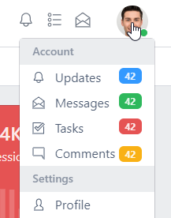
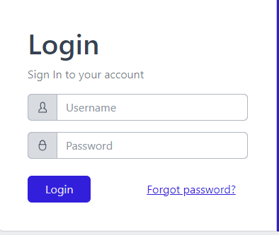
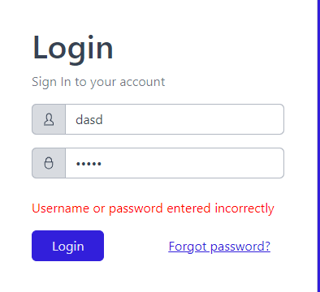

# Task Typescript:

### Pagina profile poate fi accesată după ce tastați pe profilul vostru din navbar.

## Pagina de login

### Se face redirect la pagina de login după ce se apasă pe butonul de profile din navbar, în cazul în care nu sunteți logat.

### Dacă parola este introdus ceva grșit se va afișa un mesaj de eroare.

## Pagina cu tabelul

### Tabelul poate fi gasit după path-ul: src/app/views/base/tables

## Problema cu filtrele Multiple select

### La moment filtrele lucrează doar dacă se adaugă sau se deselectează un singur element, dar nu am reușit să fac să funcționeze și cu mai multe elemente selectate.

### Chiar dacă array-ul este returnat gol, oricum el se execută doar după apăsarea repetă

### Probelma poate fi și în cunoțtințele mele sărace în acest framework sau trebuie să schimb modulul care răspunde de acest select

## Service

### Service-ul poate fi gasit după path-ul: src/app/services

# Dashboad

## Nu am facut eu, căci la moment pot spune că știu doar să fac Back + Google, dar am înțeles cum funcționează și cum se pot face alte funcționalități(Sper că am înțesles). 

